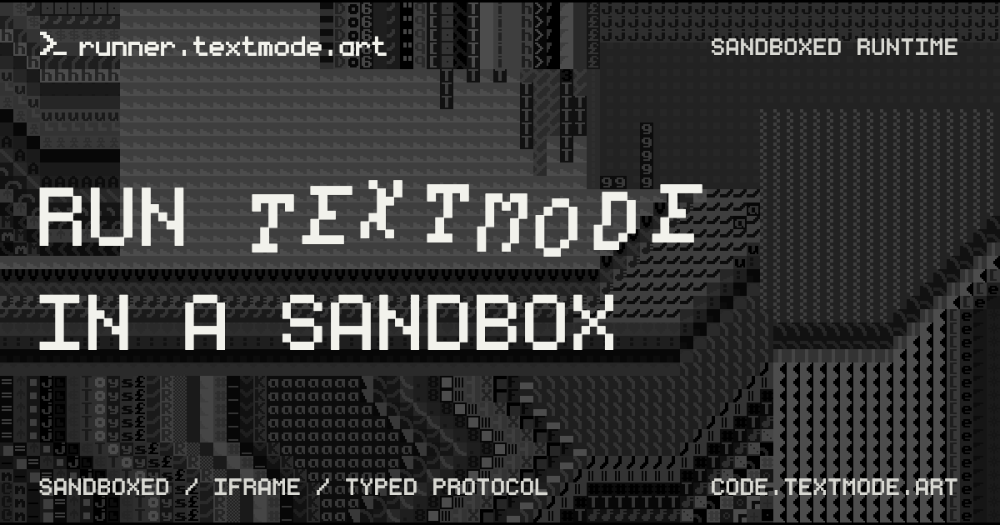

# runner.textmode.art

<div align="center">



| [](https://www.typescriptlang.org/) [](https://vitejs.dev/) | [](https://code.textmode.art/) [](https://discord.gg/sjrw8QXNks) | [](https://ko-fi.com/V7V8JG2FY) [](https://github.com/sponsors/humanbydefinition) |
|:-------------|:-------------|:-------------|

</div>

`runner.textmode.art` is the sandboxed iframe runtime for
[`textmode.js`](https://github.com/humanbydefinition/textmode.js). This monorepo
hosts the runner app served at [runner.textmode.art](https://runner.textmode.art/)
alongside the browser packages host apps use to embed it: the
[`runner-client`](./packages/runner-client) iframe client and the
[`runner-protocol`](./packages/runner-protocol) wire contract.

Host apps like [editor.textmode.art](https://editor.textmode.art/) mount the
runner to execute user sketches in an isolated browser context, away from the
host document. Inside the sandbox, the runner boots a `textmode.js` rendering
environment with the textmode plugin stack (synth, figlet, filters, and export)
and talks to its host through a small typed message protocol with capability
negotiation, heartbeats, and in-place runtime resets.

## Features

- **Sandboxed execution:** Runs user sketches in an isolated browser context,
  away from the host document, behind a strict parent-origin allowlist and a
  minimal iframe sandbox.
- **textmode.js runtime:** Boots a [`textmode.js`](https://github.com/humanbydefinition/textmode.js)
  rendering environment with the official plugin stack: synth, figlet, filters,
  and export.
- **Typed message protocol:** Hosts and the runner exchange messages over a
  [`MessagePort`](https://developer.mozilla.org/en-US/docs/Web/API/MessagePort)
  through a shared, validated wire contract with capability negotiation.
- **Live runtime control:** `runCode` swaps the active sketch in place, and
  `resetRuntime` rebuilds the textmode runtime without replacing the iframe
  document.
- **Heartbeat monitoring:** The runner reports liveness and status so hosts can
  surface connectivity to users.

## Try it online

The runner powers the sketches in [editor.textmode.art](https://editor.textmode.art/).
Open the editor and run any sketch. The sandboxed runtime handles execution
with no local toolchain required.

## Workspaces

| Workspace | Purpose | License |
|:--|:--|:--|
| [`apps/runner`](./apps/runner) | Hosted Vite app deployed to [runner.textmode.art](https://runner.textmode.art). | AGPL-3.0 |
| [`packages/runner-protocol`](./packages/runner-protocol) | Shared wire protocol types, capabilities, and runtime validators. | CC0-1.0 |
| [`packages/runner-client`](./packages/runner-client) | Browser iframe client used by host apps to mount, run, reconnect, and dispose the runner. | AGPL-3.0 |

Public package imports are root-only:

```ts
import { IframeTextmodeRuntime } from '@textmode/runner-client';
import { isRunnerMessage } from '@textmode/runner-protocol';
```

## Development

Install dependencies from the monorepo root:

```sh
npm install
```

Start the runner app:

```sh
npm run dev
```

Run the full workspace checks:

```sh
npm run check
```

Generate package API documentation:

```sh
npm run build:docs
```

## Deployment

GitHub Pages deployment is handled by
[`.github/workflows/deploy.yml`](./.github/workflows/deploy.yml). It runs the
project checks, builds the workspace with production host origins, and uploads
`apps/runner/dist` as the Pages artifact.

The runner app has its own deployment and environment notes in
[`apps/runner/README.md`](./apps/runner/README.md).

## Publishing

`@textmode/runner-protocol` and `@textmode/runner-client` are published from
this monorepo.

Verify the tarball contents before publishing either package:

```sh
npm pack --dry-run -w @textmode/runner-protocol
npm pack --dry-run -w @textmode/runner-client
```

Publish public scoped packages with:

```sh
npm publish --access public -w @textmode/runner-protocol
npm publish --access public -w @textmode/runner-client
```

Publish `@textmode/runner-protocol` before `@textmode/runner-client` when
releasing matching first-party versions, because the client depends on the
protocol package.

## Contributing

Thank you for considering contributing to this project!

Please read the [Contributing Guide](https://code.textmode.art/docs/contributing/code)
and the [Code of Conduct](./CODE_OF_CONDUCT.md) before getting started.

## License

This monorepo contains packages under different licenses:

- [`apps/runner`](./apps/runner/LICENSE): AGPL-3.0
- [`packages/runner-client`](./packages/runner-client/LICENSE): AGPL-3.0
- [`packages/runner-protocol`](./packages/runner-protocol/LICENSE): CC0-1.0

The root [`LICENSE`](./LICENSE) covers the AGPL-licensed parts of the repository.
