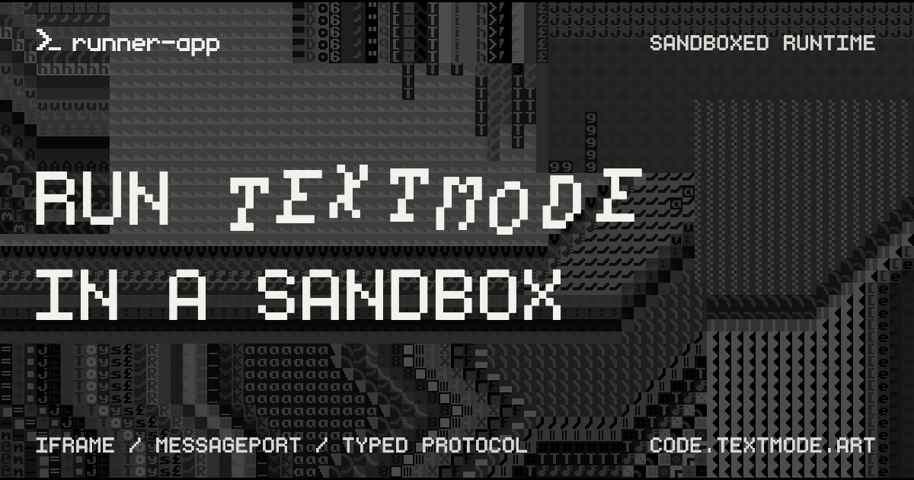

# @textmode/runner-app

<div align="center">



| [](https://www.typescriptlang.org/) [](https://vitejs.dev/) | [](https://code.textmode.art/) [](https://discord.gg/sjrw8QXNks) | [](https://ko-fi.com/V7V8JG2FY) [](https://github.com/sponsors/humanbydefinition) |
|:-------------|:-------------|:-------------|

</div>

`@textmode/runner-app` is the hosted sandbox runner app for textmode browser
hosts. It is served from [runner.textmode.art](https://runner.textmode.art/)
and is meant to be embedded as an iframe by the trusted editor app at
[editor.textmode.art](https://editor.textmode.art/), with
[synth.textmode.art](https://synth.textmode.art/) allowed during the domain
cutover.

Use it to execute user sketches away from the host document. The runner manages
a [`textmode.js`](https://github.com/humanbydefinition/textmode.js) runtime with
the textmode plugin stack installed and communicates with the parent app through
[`@textmode/runner-protocol`](../packages/runner-protocol/README.md).

## Features

- **Sandboxed execution** - Runs user sketches in an isolated browser context,
  away from the host document.
- **Generic handshake** - Accepts the generic runner handshake from allowed
  parent origins only.
- **MessagePort transport** - Establishes a `MessagePort` transport after
  `INIT`.
- **Capability reporting** - Reports runner capabilities through `READY`.
- **Sketch execution** - Runs sketch code, heartbeat pings, UI toggle events,
  and user interaction events.
- **In-place runtime resets** - Rebuilds the complete sketch runtime on request
  without replacing the iframe document or MessagePort.
- **Plugin stack** - Keeps `textmode.js`, `textmode.synth.js`,
  `textmode.figlet.js`, `textmode.filters.js`, and `textmode.export.js`
  available inside sketches through the sandboxed `t` instance.
- **Top-level redirect** - Redirects top-level production visits back to the
  configured parent app while still allowing local debug access with `?debug`.

## Development

Install dependencies from the monorepo root:

```sh
npm install
```

Start the dev server (port `5181`):

```sh
npm run dev -w @textmode/runner-app
```

Or run workspace commands directly:

```sh
npm run build -w @textmode/runner-app
npm run check-types -w @textmode/runner-app
npm run lint -w @textmode/runner-app
npm run test -w @textmode/runner-app
```

## Environment

The Vite config reads environment files from the monorepo root.

| Variable | Purpose |
|:--|:--|
| `VITE_RUNNER_PARENT_ORIGINS` | Comma-separated list of allowed parent origins. Defaults to `*` in development and an empty list in production when unset. |
| `VITE_RUNNER_FALLBACK_URL` | Production fallback URL for top-level redirects when no allowed parent origin is configured. |

Example production origins:

```sh
VITE_RUNNER_PARENT_ORIGINS=https://synth.textmode.art,https://editor.textmode.art
VITE_RUNNER_FALLBACK_URL=https://editor.textmode.art
```

## Deployment

The root GitHub Pages workflow builds the full monorepo and uploads this app's
build output from:

```txt
apps/runner/dist
```

The app includes [`public/CNAME`](./public/CNAME), which is copied into `dist`
during the Vite build so GitHub Pages keeps serving the custom domain.

## Next steps

- **[Read the runner overview](../..)** for the workspace conventions.
- **[Browse all packages](../../packages/README.md)** to find related runner packages.
- **[Visit code.textmode.art](https://code.textmode.art/)** for the ecosystem documentation.

## License

The `@textmode/runner-app` package is licensed under the [AGPL-3.0 License](./LICENSE).
