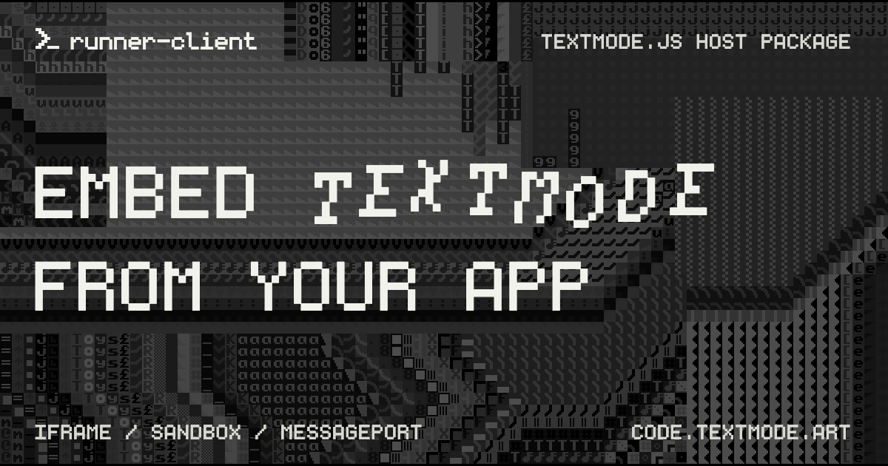

# @textmode/runner-client

<div align="center">



| [](https://www.typescriptlang.org/) | [](https://code.textmode.art/) [](https://discord.gg/sjrw8QXNks) | [](https://ko-fi.com/V7V8JG2FY) [](https://github.com/sponsors/humanbydefinition) |
|:-------------|:-------------|:-------------|

</div>

`@textmode/runner-client` is a browser iframe runtime client for the hosted
[`textmode.js`](https://github.com/humanbydefinition/textmode.js) runner. It
gives any browser host app a typed runtime API for mounting the runner iframe,
performing the generic protocol handshake, routing request/response messages,
monitoring heartbeat status, running code, reconnecting, and disposing the
transport.

Use it to embed the sandboxed runner at [runner.textmode.art](https://runner.textmode.art/)
from your own host app. It does not execute `textmode.js` sketches directly; it
controls a runner app at the `runnerUrl` you provide.

## Features

- **Typed runtime API** - Mount, run, reconnect, and dispose the runner through
  one `IframeTextmodeRuntime` instance.
- **Sandboxed iframe** - Mounts the runner under a minimal iframe sandbox and
  refuses unsafe `allow-scripts` plus `allow-same-origin` combinations on the
  parent origin.
- **Request/response routing** - Matches `runCode` and other requests to their
  responses across the `MessagePort` transport.
- **Heartbeat monitoring** - Reports runner liveness and status for host UI
  state.
- **In-place runtime resets** - `resetRuntime` rebuilds the textmode runtime
  without replacing the iframe document or transport.
- **WebKit activation handling** - Surfaces `USER_ACTIVATION_REQUIRED` so hosts
  can expose the frame for a trusted child-frame interaction.

## Installation

```sh
npm install @textmode/runner-client
```

`@textmode/runner-protocol` is installed as a dependency and is also available
for consumers that need the protocol types directly.

## Usage

```ts
import {
	IframeTextmodeRuntime,
	RunnerRequestError,
	type RunnerRuntimeStatus,
} from '@textmode/runner-client';

const container = document.querySelector<HTMLElement>('#runner');

if (!container) {
	throw new Error('missing runner container');
}

const runtime = new IframeTextmodeRuntime({
	runnerUrl: 'https://runner.textmode.art/',
	onUserActivationRequired() {
		container.dataset.userActivation = 'required';
	},
	onUserInteraction() {
		delete container.dataset.userActivation;
	},
	onStatusChange(status: RunnerRuntimeStatus, reason) {
		console.info('runner status changed', status, reason);
	},
});

await runtime.init(container);

try {
	await runtime.runCode(`
		t.draw(() => {
			t.print('textmode', 0, 0);
		});
	`);
} catch (error) {
	if (error instanceof RunnerRequestError) {
		console.error(error.message, error.line, error.column);
	}
}

runtime.dispose();
```

## Public API

Import from the package root only:

```ts
import { IframeTextmodeRuntime } from '@textmode/runner-client';
```

Public subpath imports are intentionally not supported. Internal modules such
as request routing, heartbeat control, iframe mounting, and sandbox policy may
change without a semver-major release.

The main exports are:

- `IframeTextmodeRuntime`
- `RunnerRuntimeStatus`
- `RunnerExecutionError`
- `RunnerRequestError`
- `IframeTextmodeRuntimeOptions`
- `IframeMountMode`
- `IframeSandboxToken`
- `DEFAULT_IFRAME_SANDBOX_TOKENS`

## Runtime Lifecycle

Typical host apps follow this lifecycle:

1. Create an `IframeTextmodeRuntime` with a trusted `runnerUrl`.
2. Call `init(container)` from a browser context.
3. Use `runCode` to replace the current sketch execution while preserving its timeline.
4. Use `resetRuntime` to rebuild textmode while preserving the current iframe document and its browser interaction state.
5. Call `reconnect` only when the iframe document or transport must be replaced.
6. Call `dispose` when the host view is unmounted.

`resetRuntime` falls back to reconnecting when an older runner does not
advertise the optional `runtimeReset` capability.

Cross-origin WebKit runners may request one trusted child-frame interaction
through `onUserActivationRequired`. A host can temporarily expose or elevate
the existing iframe until `onUserInteraction` fires. Programmatic focus or a
synthetic parent-page click is not an equivalent substitute.

The runtime exposes `status`, `isReady`, and `frame` getters for host UI state.

## Sandbox Policy

The default iframe sandbox tokens are:

```ts
['allow-scripts', 'allow-same-origin']
```

`allow-downloads` is not included by default. Sketches can use the installed
`textmode.export.js` helpers inside the sandboxed runtime, but the host client
does not expose a parent-controlled export channel.

The runtime refuses to start a runner that combines `allow-scripts` and
`allow-same-origin` on the same origin as the parent page.

## Related packages

`@textmode/runner-client` works with the following packages in this repository:

| Package                                                              | Relationship                                      |
| -------------------------------------------------------------------- | ------------------------------------------------- |
| [`@textmode/runner-protocol`](../runner-protocol/README.md)          | The wire contract this client speaks              |
| [`@textmode/runner-app`](../../apps/runner/README.md)                | The sandboxed runner app this client controls     |

## Next steps

- **[Read the runner overview](../../README.md)** for the workspace conventions.
- **[Browse all packages](../README.md)** to find related runner packages.
- **[Browse the API docs](./api/runner-client/index.md)** for the generated type reference.
- **[Visit code.textmode.art](https://code.textmode.art/)** for the ecosystem documentation.

## License

The `@textmode/runner-client` package is licensed under the [AGPL-3.0-or-later License](./LICENSE).
