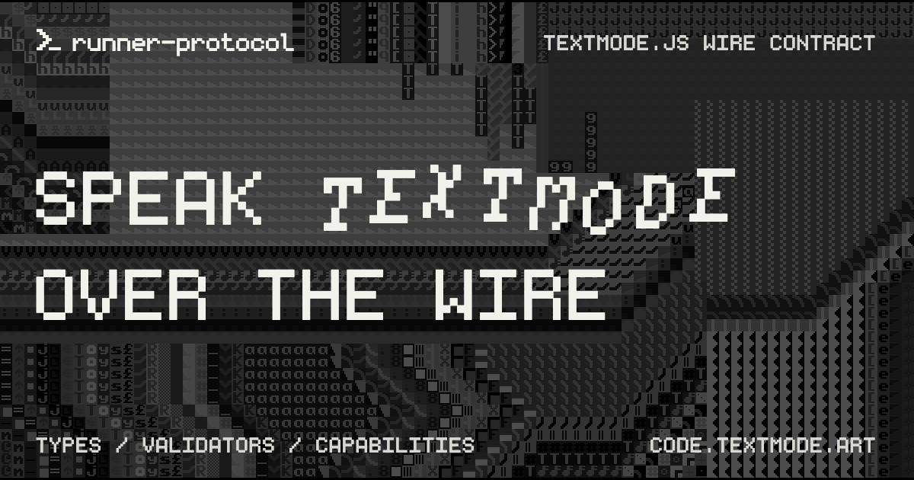

# @textmode/runner-protocol

<div align="center">



| [](https://www.typescriptlang.org/) | [](https://code.textmode.art/) [](https://discord.gg/sjrw8QXNks) | [](https://ko-fi.com/V7V8JG2FY) [](https://github.com/sponsors/humanbydefinition) |
|:-------------|:-------------|:-------------|

</div>

`@textmode/runner-protocol` is the shared TypeScript message contract for the
hosted [`textmode.js`](https://github.com/humanbydefinition/textmode.js) runner
iframe. It is the single source of truth for the wire messages exchanged by the
runner and browser host apps in the textmode.js ecosystem, containing the public
message types, capability model, and runtime validators used on both sides of
the iframe boundary.

Use it to keep the runner and its host clients on the same validated wire
contract, with feature availability described through a small capability payload
instead of runtime version negotiation.

## Features

- **Single source of truth** - The message unions, capability model, and
  validators shared by the runner and browser host apps.
- **Capability model** - Feature availability is advertised through
  `RunnerCapabilities` rather than protocol version negotiation.
- **Strict runtime validators** - Guards reject untrusted `postMessage` payloads
  before they are dispatched.
- **Root-only imports** - The public API imports from the package root only, so
  internal modules stay free to change.
- **No version negotiation** - Package semver describes source compatibility;
  the package describes the one current message shape.

## Installation

```sh
npm install @textmode/runner-protocol
```

## Usage

```ts
import {
	createRunnerCapabilities,
	isParentMessage,
	isRunnerMessage,
	type ParentToRunnerMessage,
	type RunnerToParentMessage,
} from '@textmode/runner-protocol';

const capabilities = createRunnerCapabilities();

function handleParentMessage(message: unknown): void {
	if (!isParentMessage(message)) {
		return;
	}

	runMessage(message);
}

function sendRunnerMessage(message: RunnerToParentMessage): void {
	if (isRunnerMessage(message)) {
		port.postMessage(message);
	}
}

function runMessage(message: ParentToRunnerMessage): void {
	switch (message.type) {
		case 'RUN_CODE':
			runCode(message.code, message.requestId);
			break;
		case 'RESET_RUNTIME':
			resetRuntime(message.code, message.requestId);
			break;
		case 'PING':
			port.postMessage({ type: 'PONG', nonce: message.nonce, timestamp: Date.now() });
			break;
	}
}
```

## Public API

Import from the package root only:

```ts
import { isRunnerMessage, type ParentToRunnerMessage } from '@textmode/runner-protocol';
```

Public subpath imports are intentionally not supported. This keeps the protocol
package free to reorganize internal modules without breaking consumers.

The main exports are grouped around:

- capabilities: `RunnerCapabilities`, `createRunnerCapabilities`
- messages: `InitMessage`, `ParentToRunnerMessage`, `RunnerToParentMessage`,
  `Message`
- guards: `isInitMessage`, `isParentMessage`, `isRunnerMessage`,
  `isRunnerCapabilities`

## Protocol Model

The runner protocol has one current message shape. Runtime protocol version
negotiation is intentionally absent: npm package semver describes source
compatibility, while runner feature availability is described through the small
capability payload.

The initial window message is generic for every host app:

```ts
{ type: 'INIT' }
```

After a successful handshake, the runner responds with:

```ts
{ type: 'READY', capabilities: RunnerCapabilities }
```

The current capability payload is:

```ts
{ heartbeat: true, runtimeReset: true, userActivationPrompt: true }
```

Messages sent after that point use the `ParentToRunnerMessage` and
`RunnerToParentMessage` unions.

Runners that advertise `userActivationPrompt` may emit
`USER_ACTIVATION_REQUIRED` when a browser requires trusted interaction inside
the iframe. Hosts should expose the frame for interaction until the runner
answers with `USER_INTERACTION`.

## Validation

The exported guards are strict runtime validators for untrusted `postMessage`
payloads. Use them before dispatching messages across the iframe boundary:

```ts
if (!isRunnerMessage(event.data)) {
	return;
}
```

The guards reject retired app-identity and protocol-version fields such as
`client`, `v`, `clients`, and `protocolVersions`.

## Related packages

`@textmode/runner-protocol` is consumed by the following packages in this
repository:

| Package                                                        | Relationship                                             |
| -------------------------------------------------------------- | -------------------------------------------------------- |
| [`@textmode/runner-client`](../runner-client/README.md)        | Sends and receives these messages as a host client      |
| [`@textmode/runner-app`](../../apps/runner/README.md)          | Implements this contract inside the sandboxed runner    |

## Next steps

- **[Read the runner overview](../../README.md)** for the workspace conventions.
- **[Browse all packages](../README.md)** to find related runner packages.
- **[Browse the API docs](./api/runner-protocol/index.md)** for the generated type reference.
- **[Visit code.textmode.art](https://code.textmode.art/)** for the ecosystem documentation.

## License

The `@textmode/runner-protocol` package is licensed under the [CC0 1.0 Universal](./LICENSE).
